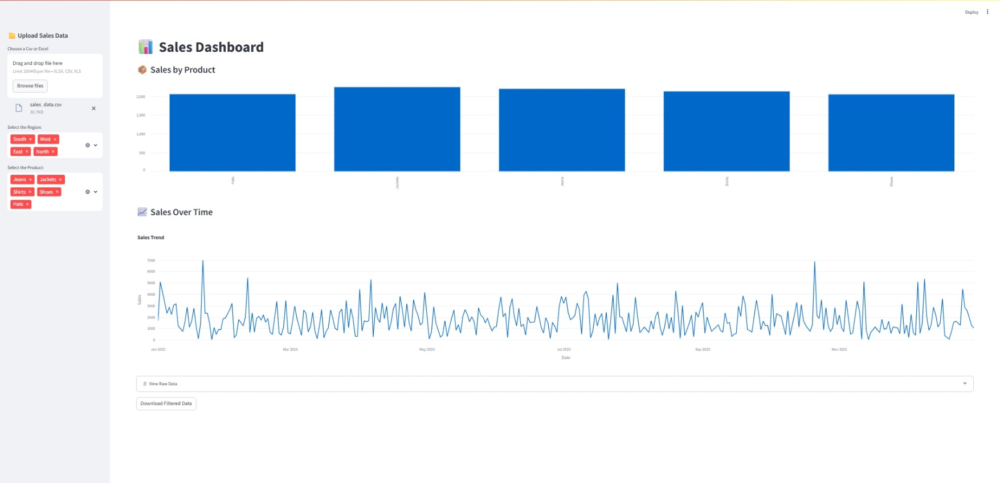

# 🛍️ Streamlit Retail Sales Dashboard

A fully interactive web app built using **Python**, **Streamlit** and **Plotly** to visualize and analyze retail sales data.

## 📊 Features

- 📂 Upload your own CSV/Excel sales data
- 🌍 Filter by Region and Product
- 💡 See KPIs: Total Sales, Quantity Sold, Unique Products
- 📈 Visualize trends with charts and plots
- 📥 Download filtered data

## 📁 Sample Data Format

| Date       | Region   | Product    | Quantity | Price |
|------------|----------|------------|----------|-------|
| 2023-01-01 | East     | Laptop     | 2        | 1000  |
| 2023-01-03 | West     | Smartphone | 5        | 600   |

> You can use `sales_data.csv` to test the dashboard.

## Screenshot


## ⚙️ Prerequisites

- Python 3.7 or higher
- `pip` for managing Python packages
  
## ▶️ How to Run

Install dependencies:
```bash
pip install -r requirements.txt
```
## ▶️ Run the App

Launch the app:
```bash
#Run the app
streamlit run app.py

# quit
ctrl-c
```

## 📦 Installation

1. **Clone the Repository**

```bash
git clone https://github.com/pvnkm/Streamlit-Sales-Dashboard.git
cd Streamlit-Sales-Dashboard
